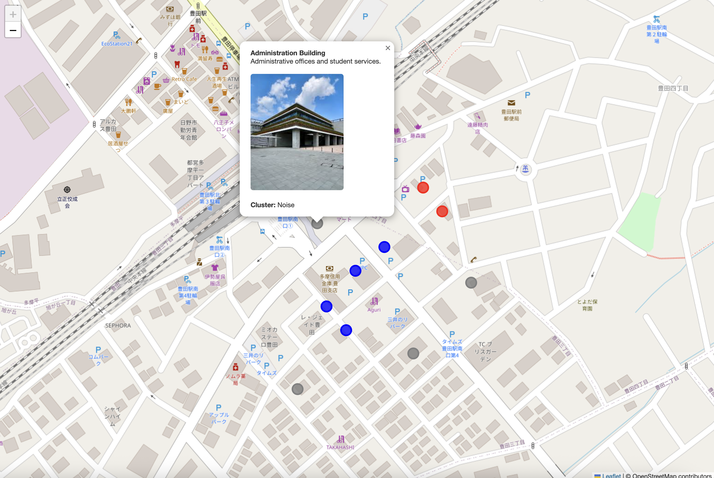

# TMU Hino Campus Web GIS (DBSCAN)

## Project Overview
This project is a Web GIS application developed as part of the **Spatiotemporal Data Processing** seminar.  
It presents an interactive map of **Tokyo Metropolitan University (TMU) Hino Campus**, where campus buildings are visualized and analyzed using a spatial clustering algorithm.

The project demonstrates how **Web GIS technologies** can be combined with a **spatial algorithm covered in class (DBSCAN)** to perform interactive geographic data analysis in a web browser.

---

## Demo Preview of Web GIS

---

## Features
- Interactive web-based map using Leaflet
- OpenStreetMap basemap
- Campus buildings represented as spatial point features
- Clickable markers with:
  - Building name
  - Short description
  - Image
  - Cluster label
- Color-coded visualization of clusters
- Identification of isolated buildings as noise

---

## Algorithm Used: DBSCAN

**DBSCAN (Density-Based Spatial Clustering of Applications with Noise)** is used to group campus buildings based on spatial proximity.

### Why DBSCAN?
- Covered in the course syllabus
- Suitable for spatial data
- Does not require a predefined number of clusters
- Can identify dense areas as well as isolated points (noise)

### Key Parameters
- **ε (epsilon):** Distance threshold that defines the neighborhood radius
- **MinPts:** Minimum number of points required to form a cluster

Buildings that do not meet the density requirements are labeled as **noise**, which is expected behavior of DBSCAN.

---

## Technologies Used
- HTML
- JavaScript
- Leaflet.js
- OpenStreetMap
- DBSCAN clustering algorithm

---

## Project Structure
- tmu_hino_webgis/
- │── tmu_hino_webgis.html
- │── library.jpg
- │── lecture.jpg
- │── cafeteria.jpg
- │── research.jpg
- │── admin.jpg
- │── student_center.jpg
- │── gym.jpg
- │── workshop.jpg
- │── gate.jpg
- │── README.md

---

## How to Run the Project
1. Download or clone the project folder
2. Ensure an internet connection (for OpenStreetMap tiles)
3. Open `tmu_hino_webgis.html` in a web browser
4. Click on building markers to view details and cluster information

No server setup is required for this demonstration.

---

## Learning Outcomes
- Understanding the concept of Web GIS
- Visualizing spatial data in a web environment
- Applying DBSCAN to geographic point data
- Interpreting clustering results and noise detection
- Integrating spatial algorithms with web-based maps

---

## Limitations
- Small dataset (limited number of campus buildings)
- DBSCAN results depend on parameter selection
- Demonstration-level implementation

---

## Future Improvements
- Add more campus buildings
- Load spatial data from GeoJSON files
- Compare DBSCAN results with other spatial algorithms (e.g., R-tree)
- Add temporal or dynamic data

---

## Author
**Awais Ahmed Channa**  
Tokyo Metropolitan University
